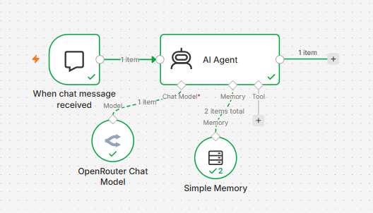
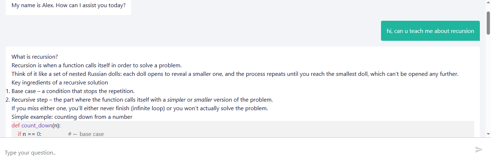

# AI Learning Assistant using n8n

## Overview

This project is an AI-powered Learning Assistant buit using n8n. It helps students understand computer science, programming and technology concepts, summarize technical content, draft professional emails and brainstorm learning ideas using a conversational AI inteface.

The workflow integrates AI capabilities into an automated system, demonstrating worflow automation, prompt engineering, and AI application development.

---

## Motivation

As AI tools become increasingly important in education and software development, I wanted to build a practical assistant that combines automation with natural language understanding.

This project also allowed me to gain hands-on experience with workflow automation, API integration, prompt engineering, and designing AI-powered user experiences using n8n.

---

## Features 

- Explains computer science and programming concepts 
- Summarize technical articles and notes
- Draft professional emails
- Brainstorm project ideas
- Conversational AI interface
- Automated workflow built in n8n
- Modular workflow design for future expansion

---

## Wokflow Architecture

The workflow receives a user's request, proesses it through an AI model using carefuly designed prompts, and returns an educational response tailored to the user's question.

The workflow includes:
- Chat trigger
- AI Agent
- Language Model integration
- Prompt engineering
- Response generation

---

## Technology / Tools used 

- n8n
- OpenRouter API for AI model access
- Large Language Models (LLMs)
- Prompt Engineering
- JSON workflow configuration
- GitHub 

---

## How it Works?

1. User submits a question.
2. The workflow receives the request.
3. The AI agent interprets the system prompt.
4. The language model generates a response.
5. The response is returned to the user.

---

## AI Agent Design and System Prompt

The AI assistant's behaviour is controlled trough a custom system prompt.

Instead of training a new AI model, the assistant is configured using prompt engineering techniques. The system prompt provides the AI agent with:

- Its role and purpose
- How it should communicate
- The type of responses it should provide
- How it should support students
- Guidlines for explaining technical concepts, learning, brainstorming and writing tasks

The system prompt allows the AI agent to behave consistently and responds like a learning assistant rather than a general chatbot.

---

## Project Structure 

```text
ai-learning-assistant-n8n/
├── README.md
├── LICENSE
├── workflow.json
└── images/
    ├── workflow-overview.png
    └── assistant-demo.png
```

---

## Screenshots

### Workflow Overview



### Assistant Demo



---

## Lesson Learned 

Through this project I learned how to:

- Build AI-powered workflows using n8n
- Design effective prompts for AI assistants
- Export and document workflow automation projects
- Organise projects using GitHub
- Structure portfolio-ready documentation

---

## Future Improvements

- Add conversation memory
- Support document uploads
- Integrate additional AI tools
- Add multiple educational modes
- Improve response personalization

--- 

## Author 

**Mariyam Faisal**

This project was created as part of my portfolio to demonstrate skills in AI workflow automation, prompt engineering and software development.
